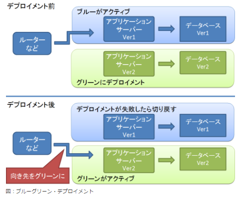
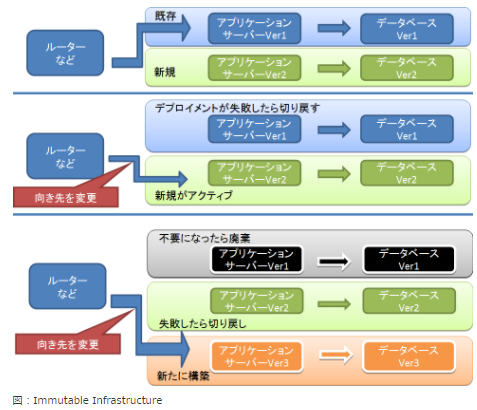

<!-- $theme: gaia -->

# チーム開発実践入門
## 6.6-6.7
### Hiroshi Kobayashi

---
<!-- page_number: true -->

# 6.6 運用について考慮する

## ちゃんと考えないといけない課題
* デプロイ中に発生するサービス中断
* バージョンUPに起因する不具合の対処

---
## デプロイの種類
色々あるけど、結論から言っちゃうとイミュータブル・デプロイがベストっぽい

## サービス停止＆デプロイ
最もシンプルですが駄目な奴。サービスを停止させないとデプロイできない悲しい方法。
今のUmayadoはこれです。ごめんなさい

## シンボリックリンク・デプロイ
CapistranoやFabricが有名どころ。各サーバーに新しいアプリを配置してから一気にシンボリックリンクを書き換えていき、新しいアプリに向けさせる方法。
ロールバックする場合は以前のシンボリックリンクに戻す。
たまにロールバックに失敗して悲しいことになることも。
Railsなどが流行ったときはこれが主流だったらしい

## ローリング・デプロイ
１台ずつサーバーをロードバランサから切り離して、デプロイしデプロイが終わったらサーバーをロードバランサに戻す手法。一時的とはいえ新旧のサーバが混在するため、そこは気をつける必要あり。

## ブルーグリーン・デプロイ
ブルーとグリーンという２つの環境を用意し、ブルーが動いているときグリーンにデプロイし、デプロイが終わったらブルーとグリーンを入れ替える方法。例えば、AWSのElastic BeanstalkがCNAMEをスワップさせることでこれを実現している（２つの環境を用意し、URLを一瞬で入れ替える）
ロールバックする場合は、再度スワップする。
# 

## イミュータブル・デプロイ
ブルーグリーン・デプロイに近い（寧ろ、その仕組みを使う）が、新バージョンでのアプリ環境を都度生成し、そちらに切り替えて使わなくなった環境は捨てるという手法。
DockerやAnsibleなどの構成管理ツールで環境の構築からデプロイ、入れ替え、破棄まで一括してやってしまうことが多い。
# 

---
## ロールバックは大事
退路は常に用意すべし。ロールバックできないリリースは実施すべきじゃない。  
データベースのロールバックはマイグレーションツールを利用すべし。
前章のロールバックもFabricやCapistranoで自動化しておくとなおよし。

### どうしてもロールバックできないケース
* システム上そのデータを失うことが許されていない
* ロールバック時に一貫性制約に違反する可能性がある場合  

→リスクが高い更新は、ユーザの影響が少ない日付・時間帯に停止メンテナンス期間を設けるべし。

# 6.7 6章のまとめ

旧来からのデプロイには職人芸が必要だったが、自動化が回り始めれば職人芸は必要ない！  
上層の説得は動くもの持ってデモをするのが効果的(百聞は一見にしかず) 
